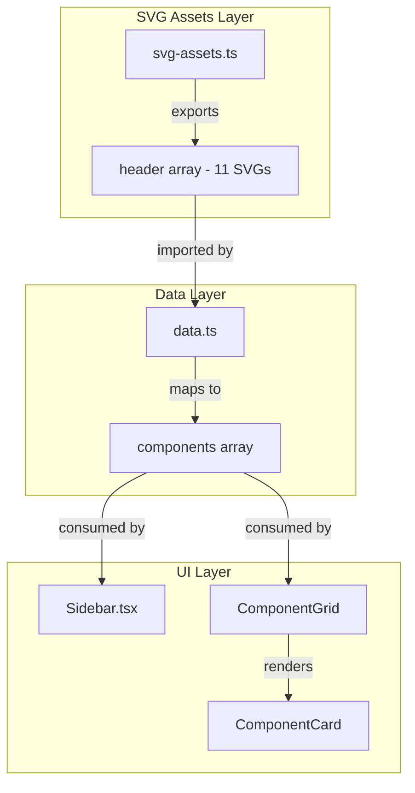

# Design Document: Header Component Library

## Overview

This design adds a "Header" component category to the Framer UI Vault plugin, providing 11 skeletal header/navigation layout variants. The implementation follows the established patterns in the codebase where SVG assets are defined in `src/svg-assets.ts` and mapped to component objects in `src/data.ts`. The UI automatically discovers new categories through the existing `getUniqueCategories()` function in the Sidebar component.

The header variants cover diverse navigation patterns: minimal, floating/pill, center-logo, glass/blur, dark theme, underline-active, boxed/bordered, gradient-accent, sidebar navigation, center-CTA, and thin/compact styles.

## Architecture

The feature integrates into the existing plugin architecture with minimal changes:



The architecture leverages the plugin's existing category discovery mechanism—when header components are added to the `components` array in `data.ts`, the Sidebar automatically displays the "Header" category through its `getUniqueCategories()` function.

## Components and Interfaces

### SVG Assets Module (`src/svg-assets.ts`)

New export to add:

```typescript
export const header: string[] = [
  // 11 SVG strings representing header variants
];
```

Each SVG follows the existing conventions:
- ViewBox: `viewBox="0 0 1200 100"` (wide aspect ratio appropriate for headers)
- Skeletal style: rounded rectangles for text/buttons, circles for icons
- Color palette: consistent with existing components (#0F172A, #E2E8F0, #94A3B8, etc.)

### Data Module (`src/data.ts`)

New import and mapping:

```typescript
import { ..., header } from "./svg-assets";

export const components = [
  // ... existing mappings
  ...header.map((svg, i) => ({
    id: `header-${i + 1}`,
    category: "Header",
    name: getHeaderName(i + 1),
    svg
  }))
];
```

### Header Variant Names

| Index | ID | Name | Description |
|-------|-----|------|-------------|
| 1 | header-1 | Header Minimal | Logo + nav links + CTA button |
| 2 | header-2 | Header Floating | Contained in rounded pill container |
| 3 | header-3 | Header Center Logo | Nav links on both sides of centered logo |
| 4 | header-4 | Header Glass | Translucent/blur background style |
| 5 | header-5 | Header Dark | Dark theme variant |
| 6 | header-6 | Header Underline | Active state with underline indicator |
| 7 | header-7 | Header Boxed | Bordered container style |
| 8 | header-8 | Header Gradient | Gradient accent border/element |
| 9 | header-9 | Header Sidebar | Vertical sidebar navigation layout |
| 10 | header-10 | Header Center CTA | Prominent centered call-to-action |
| 11 | header-11 | Header Thin | Compact/minimal height variant |

### Existing Interfaces (No Changes Required)

The existing `Component` interface in the codebase already supports the header components:

```typescript
interface Component {
  id: string;
  category: string;
  name: string;
  svg: string;
}
```

## Data Models

### SVG Structure Pattern

Each header SVG follows this skeletal structure:

```svg
<svg viewBox="0 0 1200 100" fill="none" xmlns="http://www.w3.org/2000/svg">
  <!-- Background -->
  <rect width="1200" height="100" fill="[background-color]" />
  
  <!-- Logo placeholder (rectangle or circle) -->
  <rect x="50" y="30" width="40" height="40" rx="8" fill="[logo-color]" />
  
  <!-- Navigation links (rounded rectangles) -->
  <rect x="[x]" y="[y]" width="60" height="10" rx="5" fill="[nav-color]" />
  
  <!-- CTA button (rounded rectangle) -->
  <rect x="[x]" y="[y]" width="100" height="40" rx="20" fill="[cta-color]" />
</svg>
```

### Color Palette (Consistent with Existing Components)

| Purpose | Light Theme | Dark Theme |
|---------|-------------|------------|
| Background | #FFFFFF, #F8FAFC | #0F172A, #111827 |
| Primary text/elements | #0F172A, #1E293B | #FFFFFF, #F8FAFC |
| Secondary elements | #94A3B8, #CBD5E1 | #64748B, #475569 |
| Accent/CTA | #3B82F6, #6366F1 | #3B82F6, #6366F1 |
| Borders | #E2E8F0 | #334155 |

### Component Registration Pattern

The header components follow the same registration pattern as existing categories:

```typescript
// Pattern from existing code
...header.map((svg, i) => ({
  id: `header-${i + 1}`,      // Unique identifier
  category: "Header",          // Category for filtering
  name: `Header ${variant}`,   // Display name
  svg                          // SVG string content
}))
```


## Correctness Properties

*A property is a characteristic or behavior that should hold true across all valid executions of a system—essentially, a formal statement about what the system should do. Properties serve as the bridge between human-readable specifications and machine-verifiable correctness guarantees.*

### Property 1: Header Array Count

*For any* build of the plugin, the exported `header` array from `svg-assets.ts` should contain exactly 11 SVG string elements.

**Validates: Requirements 1.1, 5.1-5.11**

### Property 2: Header SVG ViewBox Consistency

*For any* SVG string in the `header` array, parsing the SVG should yield a valid viewBox attribute with consistent dimensions appropriate for header layouts (width significantly greater than height).

**Validates: Requirements 1.4**

### Property 3: Header Component Structure Integrity

*For any* component in the `components` array where the id starts with "header-", the component should have:
- An `id` matching the pattern `header-{n}` where n is a positive integer
- A `category` value equal to "Header"
- A non-empty `name` string
- A non-empty `svg` string

**Validates: Requirements 2.2, 2.3, 2.4**

### Property 4: Category Filter Exclusivity

*For any* filter selection of "Header" category, all components returned by the filter should have `category === "Header"` and no components with other categories should be included.

**Validates: Requirements 3.2**

### Property 5: Search Inclusion

*For any* search query containing the substring "header" (case-insensitive), the search results should include all components where the name or category contains "header".

**Validates: Requirements 3.3**

### Property 6: Recently Used Tracking

*For any* header component that is inserted/clicked, the component's id should appear in the recently used list after the insertion action.

**Validates: Requirements 4.2**

### Property 7: Favorites Persistence Round-Trip

*For any* header component, if a user favorites the component and the favorites are persisted, then loading the favorites from storage should return a list containing that component's id.

**Validates: Requirements 4.3**

## Error Handling

### SVG Parsing Errors

If an SVG string in the header array is malformed:
- The component should still appear in the grid with a fallback placeholder
- Console warning should be logged for debugging
- Other components should not be affected

### Missing Header Array

If the header import fails or returns undefined:
- The data module should gracefully handle the missing array
- Other component categories should continue to function
- Console error should be logged

### Storage Errors (Favorites/Recently Used)

If localStorage is unavailable or quota exceeded:
- Favorites and recently used features should degrade gracefully
- In-memory state should still work for the current session
- User should not see error messages for non-critical features

## Testing Strategy

### Unit Tests

Unit tests should cover specific examples and edge cases:

1. **SVG Asset Tests**
   - Verify header array is exported and accessible
   - Verify each SVG string is non-empty
   - Verify SVG strings contain valid XML structure

2. **Data Module Tests**
   - Verify header components are included in components array
   - Verify component count increases by 11 when headers are added
   - Verify no duplicate ids exist across all components

3. **Edge Cases**
   - Empty search query handling
   - Filter with no matching components
   - Favorites list at storage limit

### Property-Based Tests

Property-based tests should use a library like `fast-check` to verify universal properties across generated inputs.

**Configuration:**
- Minimum 100 iterations per property test
- Each test tagged with: `Feature: header-component-library, Property {number}: {property_text}`

**Property Tests to Implement:**

1. **Header Array Count Property**
   - Tag: `Feature: header-component-library, Property 1: Header array contains exactly 11 elements`
   - Verify: `header.length === 11`

2. **ViewBox Consistency Property**
   - Tag: `Feature: header-component-library, Property 2: All header SVGs have consistent viewBox`
   - Generate: Random index into header array
   - Verify: SVG contains viewBox attribute with valid dimensions

3. **Component Structure Property**
   - Tag: `Feature: header-component-library, Property 3: Header components have valid structure`
   - Generate: Random header component from components array
   - Verify: Has id matching pattern, category "Header", non-empty name and svg

4. **Filter Exclusivity Property**
   - Tag: `Feature: header-component-library, Property 4: Header filter returns only header components`
   - Generate: Filter result for "Header" category
   - Verify: All results have category "Header"

5. **Search Inclusion Property**
   - Tag: `Feature: header-component-library, Property 5: Search includes matching header components`
   - Generate: Search queries containing "header"
   - Verify: Results include header components

6. **Recently Used Tracking Property**
   - Tag: `Feature: header-component-library, Property 6: Inserted components appear in recently used`
   - Generate: Random header component insertion
   - Verify: Component id in recently used list

7. **Favorites Round-Trip Property**
   - Tag: `Feature: header-component-library, Property 7: Favorites persist correctly`
   - Generate: Random header component to favorite
   - Verify: After save/load cycle, component id is in favorites

### Integration Tests

1. **UI Integration**
   - Verify "Header" category appears in sidebar when components exist
   - Verify clicking header component triggers insertion flow
   - Verify header components render in grid at thumbnail size

2. **Framer Plugin Integration**
   - Verify SVG insertion into Framer canvas (requires Framer test environment)
