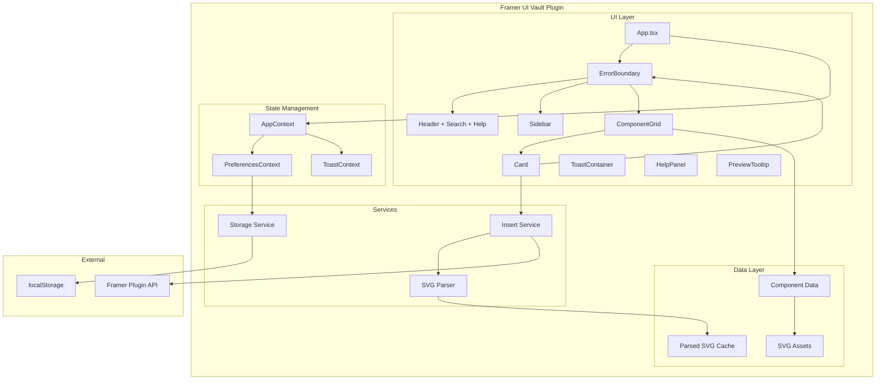
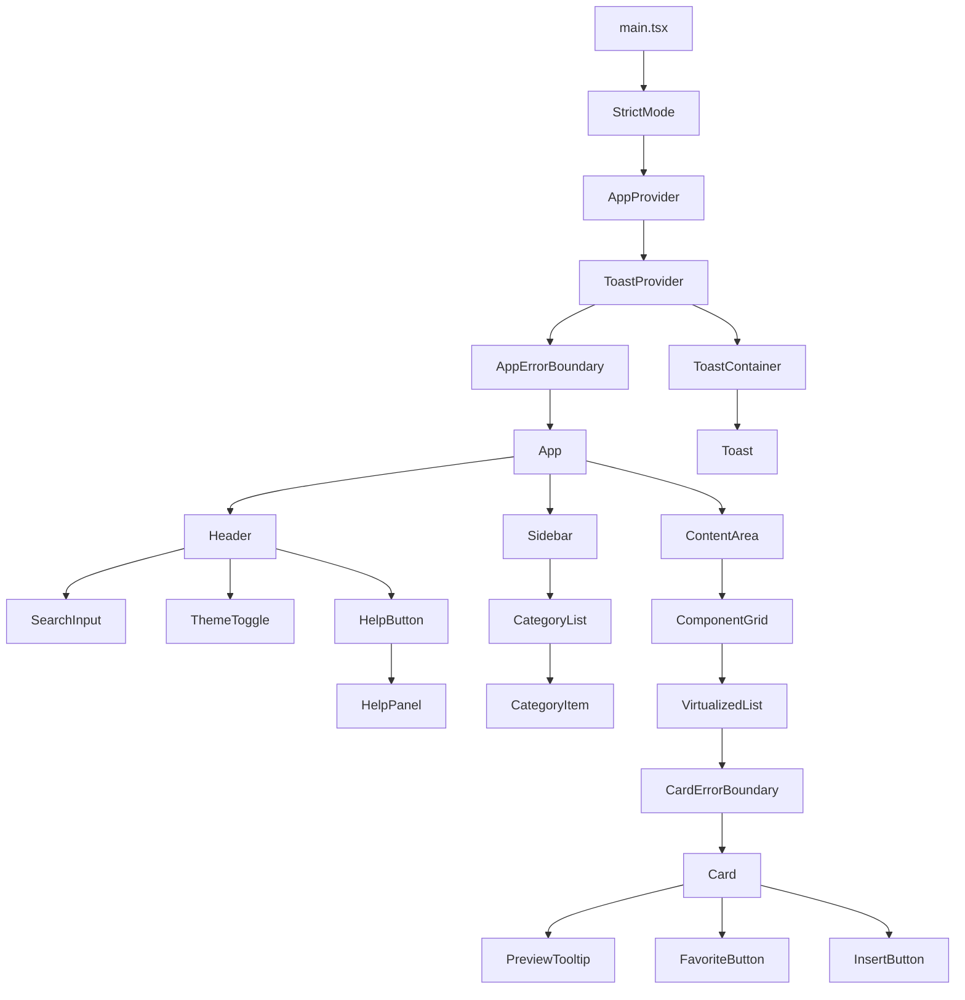

# Technical Design Document

## Overview

This design document outlines the technical implementation for comprehensive improvements to the Framer UI Vault plugin. The improvements span stability (error boundaries, SVG parser hardening), performance (lazy loading, memoization, virtualization), accessibility (keyboard navigation, screen reader support), UX enhancements (search improvements, recently used, favorites, previews), and code quality (TypeScript strict mode, proper interfaces).

The plugin is a React application running within Framer's plugin environment. It displays skeletal UI layouts as SVG previews that users can insert onto their Framer canvas as native Frame nodes. The existing architecture consists of a main App component with Sidebar navigation, Card components for previews, and a heuristic SVG parser that converts SVG elements to Framer Frame nodes.

### Key Design Decisions

1. **State Management**: Use React Context for global state (preferences, favorites, recently used) rather than prop drilling
2. **Error Handling**: Implement React Error Boundaries at multiple levels (app-level and card-level)
3. **Performance**: Leverage React.lazy, useMemo, useCallback, and react-window for virtualization
4. **Persistence**: Use localStorage for user preferences, favorites, and recently used items
5. **Accessibility**: Follow WAI-ARIA patterns with proper focus management and announcements

## Architecture



### Component Hierarchy



## Components and Interfaces

### New Components

#### ErrorBoundary
A reusable error boundary component with configurable fallback UI.

```typescript
// src/components/ErrorBoundary.tsx
interface ErrorBoundaryProps {
  children: React.ReactNode;
  fallback?: React.ReactNode;
  onError?: (error: Error, errorInfo: React.ErrorInfo) => void;
  level: 'app' | 'card';
}

interface ErrorBoundaryState {
  hasError: boolean;
  error: Error | null;
}
```

#### Toast System
A notification system for user feedback.

```typescript
// src/components/Toast.tsx
interface ToastProps {
  id: string;
  message: string;
  type: 'success' | 'error' | 'info';
  duration?: number;
  onDismiss: (id: string) => void;
}

// src/components/ToastContainer.tsx
interface ToastContainerProps {
  toasts: ToastItem[];
  onDismiss: (id: string) => void;
}
```

#### HelpPanel
In-plugin documentation panel.

```typescript
// src/components/HelpPanel.tsx
interface HelpPanelProps {
  isOpen: boolean;
  onClose: () => void;
  theme: Theme;
}
```

#### PreviewTooltip
Enlarged component preview on hover.

```typescript
// src/components/PreviewTooltip.tsx
interface PreviewTooltipProps {
  item: ComponentItem;
  anchorRect: DOMRect;
  theme: Theme;
}
```

#### VirtualizedGrid
Virtualized component grid for performance.

```typescript
// src/components/VirtualizedGrid.tsx
interface VirtualizedGridProps {
  items: ComponentItem[];
  onInsert: (item: ComponentItem) => Promise<void>;
  theme: Theme;
  columnCount: number;
  rowHeight: number;
}
```

### Updated Components

#### Card (Enhanced)
```typescript
// src/components/Card.tsx
interface CardProps {
  item: ComponentItem;
  onInsert: (item: ComponentItem) => Promise<void>;
  theme: Theme;
  isFavorite: boolean;
  onToggleFavorite: (id: string) => void;
  isLoading?: boolean;
  tabIndex?: number;
  onKeyDown?: (e: React.KeyboardEvent, item: ComponentItem) => void;
}
```

#### Sidebar (Enhanced)
```typescript
// src/components/Sidebar.tsx
interface SidebarProps {
  active: string;
  setActive: (category: string) => void;
  theme: Theme;
  categories: CategoryInfo[];
  recentlyUsedCount: number;
  favoritesCount: number;
}

interface CategoryInfo {
  name: string;
  count: number;
}
```

#### SearchInput (New Component)
```typescript
// src/components/SearchInput.tsx
interface SearchInputProps {
  value: string;
  onChange: (value: string) => void;
  onClear: () => void;
  theme: Theme;
  inputRef?: React.RefObject<HTMLInputElement>;
}
```

### Context Providers

#### AppContext
```typescript
// src/context/AppContext.tsx
interface AppState {
  theme: Theme;
  activeCategory: string;
  searchQuery: string;
  favorites: string[];
  recentlyUsed: RecentItem[];
  isHelpOpen: boolean;
}

interface AppContextValue extends AppState {
  setTheme: (theme: Theme) => void;
  setActiveCategory: (category: string) => void;
  setSearchQuery: (query: string) => void;
  toggleFavorite: (id: string) => void;
  addToRecentlyUsed: (item: ComponentItem) => void;
  clearRecentlyUsed: () => void;
  toggleHelp: () => void;
  resetPreferences: () => void;
}
```

#### ToastContext
```typescript
// src/context/ToastContext.tsx
interface ToastContextValue {
  toasts: ToastItem[];
  showToast: (message: string, type: ToastType) => void;
  dismissToast: (id: string) => void;
}
```

## Data Models

### Core Interfaces

```typescript
// src/types/index.ts

export type Theme = 'light' | 'dark';

export type ToastType = 'success' | 'error' | 'info';

export interface ComponentItem {
  id: string;
  name: string;
  category: string;
  svg: string;
}

export interface RecentItem {
  id: string;
  timestamp: number;
}

export interface ToastItem {
  id: string;
  message: string;
  type: ToastType;
  createdAt: number;
}

export interface UserPreferences {
  theme: Theme;
  lastCategory: string;
  favorites: string[];
  recentlyUsed: RecentItem[];
}

export interface ThemeColors {
  primary: string;
  secondary: string;
  background: string;
  foreground: string;
  border: string;
  borderLight: string;
  textPrimary: string;
  textSecondary: string;
  bgHover: string;
  bgActive: string;
  textActive: string;
  sidebarBg: string;
  cardBg: string;
  shadow: string;
  shadowHover: string;
  // New colors for toast states
  successBg: string;
  successText: string;
  errorBg: string;
  errorText: string;
  infoBg: string;
  infoText: string;
  // Focus indicator
  focusRing: string;
}

export interface ThemeConfig {
  light: ThemeColors;
  dark: ThemeColors;
}
```

### SVG Parser Interfaces (Enhanced)

```typescript
// src/utils/heuristic-layout.ts

export type NodeType = 'rect' | 'circle' | 'text' | 'group';

export interface NodeAttributes {
  rx?: string;
  fill: string;
  imageUrl?: string | null;
  strokeWidth: string;
  stroke: string;
  // Text-specific
  originalY?: number;
  fontSize?: number;
  fontWeightStr?: string;
  fontFamily?: string;
  textData?: string;
  name?: string;
}

export interface ParsedNode {
  id: string;
  type: NodeType;
  tagName: string;
  x: number;
  y: number;
  width: number;
  height: number;
  area: number;
  children: ParsedNode[];
  attributes: NodeAttributes;
}

export interface ParseResult {
  success: boolean;
  nodes: ParsedNode[];
  errors: ParseError[];
  warnings: string[];
}

export interface ParseError {
  element: string;
  message: string;
  recoverable: boolean;
}

export interface StackProperties {
  layout?: 'stack';
  stackDirection?: 'horizontal' | 'vertical';
  gap?: string;
  padding?: string;
  stackDistribution?: string;
  stackAlignment?: string;
  position: 'absolute' | 'relative';
}
```

### Storage Schema

```typescript
// src/services/storage.ts

const STORAGE_KEYS = {
  THEME: 'framer-ui-vault-theme',
  LAST_CATEGORY: 'framer-ui-vault-last-category',
  FAVORITES: 'framer-ui-vault-favorites',
  RECENTLY_USED: 'framer-ui-vault-recently-used',
} as const;

interface StorageService {
  getPreferences(): UserPreferences;
  saveTheme(theme: Theme): void;
  saveLastCategory(category: string): void;
  saveFavorites(favorites: string[]): void;
  saveRecentlyUsed(items: RecentItem[]): void;
  clearAll(): void;
}
```

### Insert Operation Types

```typescript
// src/services/insert.ts

export type InsertStatus = 'idle' | 'loading' | 'success' | 'error';

export interface InsertResult {
  success: boolean;
  message: string;
  nodeId?: string;
  fallbackUsed?: boolean;
}

export interface InsertOptions {
  item: ComponentItem;
  onStatusChange: (status: InsertStatus) => void;
  onComplete: (result: InsertResult) => void;
}
```

