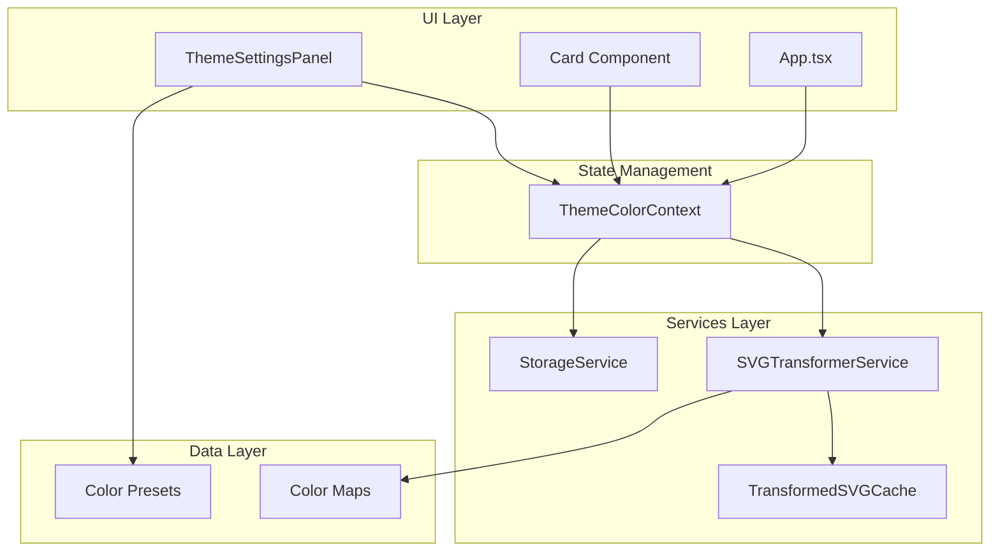
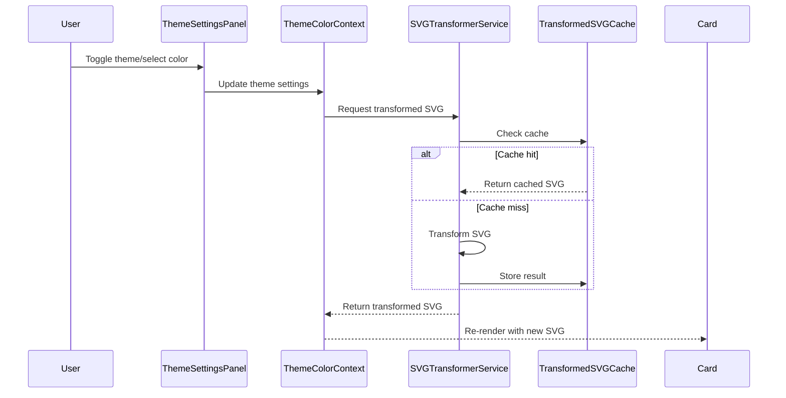

# Design Document: Theme Color Customization

## Overview

This design document outlines the technical implementation for adding comprehensive theme and color customization capabilities to the Framer UI Vault plugin. The feature enables users to toggle between dark and light modes affecting all layout previews, and customize accent/primary colors of layouts before inserting them into Framer.

The implementation follows the existing plugin architecture patterns, leveraging the established storage service for persistence, extending the SVG cache service for transformed SVG caching, and integrating with the existing theme system while adding layout-specific color transformations.

### Key Design Decisions

1. **SVG Transformation Service**: A dedicated service will handle color transformations using regex-based pattern matching for performance, avoiding DOM parsing overhead for each transformation.

2. **Caching Strategy**: Extend the existing `SvgParsingCache` pattern to cache transformed SVGs keyed by original SVG hash + theme mode + accent color, ensuring 60fps scrolling performance.

3. **Color Mapping Approach**: Use predefined color maps for theme transformations (light↔dark) with configurable accent color replacement targeting known accent color values in SVGs.

4. **UI Integration**: Theme settings will be accessible via a collapsible panel in the header area, following the existing HelpPanel pattern for consistency.

## Architecture



### Data Flow



## Components and Interfaces

### 1. ThemeColorContext (`src/contexts/ThemeColorContext.tsx`)

A new React context providing theme and color state management across the application.

```typescript
interface ThemeColorState {
  /** Layout theme mode - affects SVG backgrounds and text colors */
  layoutTheme: 'light' | 'dark';
  /** Selected accent color for interactive elements */
  accentColor: string;
  /** Whether user has customized colors (for reset functionality) */
  isCustomized: boolean;
}

interface ThemeColorContextValue extends ThemeColorState {
  /** Set the layout theme mode */
  setLayoutTheme: (theme: 'light' | 'dark') => void;
  /** Set the accent color */
  setAccentColor: (color: string) => void;
  /** Reset to default colors */
  resetToDefaults: () => void;
  /** Get transformed SVG with current theme/color settings */
  getTransformedSvg: (originalSvg: string) => string;
}
```

### 2. SVGTransformerService (`src/services/svg-transformer.ts`)

A service responsible for transforming SVG color values based on theme and accent color settings.

```typescript
interface ColorMap {
  /** Original color value (hex, rgb, or named) */
  from: string;
  /** Replacement color value */
  to: string;
}

interface TransformOptions {
  /** Target theme mode */
  themeMode: 'light' | 'dark';
  /** Accent color to apply */
  accentColor: string;
  /** Whether to preserve gradients structure */
  preserveGradients?: boolean;
}

interface SVGTransformerService {
  /** Transform an SVG string with the given options */
  transform(svg: string, options: TransformOptions): string;
  
  /** Check if a color should be categorized as background */
  isBackgroundColor(color: string): boolean;
  
  /** Check if a color should be categorized as text */
  isTextColor(color: string): boolean;
  
  /** Check if a color should be categorized as accent */
  isAccentColor(color: string): boolean;
  
  /** Calculate contrast ratio between two colors */
  getContrastRatio(color1: string, color2: string): number;
}
```

### 3. TransformedSVGCache (`src/services/transformed-svg-cache.ts`)

An LRU cache for storing transformed SVG results, extending the existing caching pattern.

```typescript
interface CacheKey {
  /** Hash of the original SVG content */
  svgHash: string;
  /** Theme mode used for transformation */
  themeMode: 'light' | 'dark';
  /** Accent color used for transformation */
  accentColor: string;
}

interface TransformedSVGCache {
  /** Get cached transformed SVG */
  get(key: CacheKey): string | undefined;
  
  /** Store transformed SVG in cache */
  set(key: CacheKey, transformedSvg: string): void;
  
  /** Check if transformation is cached */
  has(key: CacheKey): boolean;
  
  /** Clear all cached transformations */
  clear(): void;
  
  /** Clear cache entries for a specific theme/color combination */
  clearForSettings(themeMode: 'light' | 'dark', accentColor: string): void;
}
```

### 4. ThemeSettingsPanel (`src/components/ThemeSettingsPanel.tsx`)

A collapsible UI panel for theme and color customization controls.

```typescript
interface ThemeSettingsPanelProps {
  /** Whether the panel is open */
  isOpen: boolean;
  /** Callback when panel should close */
  onClose: () => void;
  /** Current UI theme for styling */
  theme: 'light' | 'dark';
}

interface ColorPreset {
  /** Unique identifier */
  id: string;
  /** Display name */
  name: string;
  /** Hex color value */
  value: string;
}
```

### 5. ColorPicker (`src/components/ColorPicker.tsx`)

A custom color picker component for selecting custom accent colors.

```typescript
interface ColorPickerProps {
  /** Current selected color */
  value: string;
  /** Callback when color changes */
  onChange: (color: string) => void;
  /** Current UI theme for styling */
  theme: 'light' | 'dark';
  /** Accessible label */
  ariaLabel?: string;
}
```

### 6. Extended Storage Service

Extend the existing `storageService` to persist theme color settings.

```typescript
// Additional storage keys
const STORAGE_KEYS = {
  // ... existing keys
  LAYOUT_THEME: 'framer-ui-vault-layout-theme',
  ACCENT_COLOR: 'framer-ui-vault-accent-color',
} as const;

// Additional methods
interface StorageServiceExtension {
  /** Save layout theme preference */
  saveLayoutTheme(theme: 'light' | 'dark'): void;
  
  /** Get layout theme preference */
  getLayoutTheme(): 'light' | 'dark';
  
  /** Save accent color preference */
  saveAccentColor(color: string): void;
  
  /** Get accent color preference */
  getAccentColor(): string;
}
```

## Data Models

### Color Presets

```typescript
const COLOR_PRESETS: ColorPreset[] = [
  { id: 'blue', name: 'Blue', value: '#3B82F6' },
  { id: 'purple', name: 'Purple', value: '#8B5CF6' },
  { id: 'green', name: 'Green', value: '#10B981' },
  { id: 'red', name: 'Red', value: '#EF4444' },
  { id: 'orange', name: 'Orange', value: '#F97316' },
  { id: 'pink', name: 'Pink', value: '#EC4899' },
  { id: 'teal', name: 'Teal', value: '#14B8A6' },
  { id: 'indigo', name: 'Indigo', value: '#6366F1' },
];

const DEFAULT_ACCENT_COLOR = '#3B82F6'; // Blue
const DEFAULT_LAYOUT_THEME = 'light';
```

### Theme Color Maps

```typescript
/** Light to dark background color mappings */
const LIGHT_TO_DARK_BACKGROUNDS: ColorMap[] = [
  { from: '#FFFFFF', to: '#0F172A' },
  { from: '#F8FAFC', to: '#1E293B' },
  { from: '#F1F5F9', to: '#334155' },
  { from: '#E2E8F0', to: '#475569' },
  { from: '#FAFAFA', to: '#18181B' },
  { from: '#F5F5F5', to: '#27272A' },
  { from: '#F9F9F9', to: '#1C1C1C' },
  { from: '#EAEAEA', to: '#3F3F46' },
  { from: '#FFF', to: '#0F172A' },
];

/** Light to dark text color mappings */
const LIGHT_TO_DARK_TEXT: ColorMap[] = [
  { from: '#000000', to: '#FFFFFF' },
  { from: '#0F172A', to: '#F8FAFC' },
  { from: '#1E293B', to: '#E2E8F0' },
  { from: '#334155', to: '#CBD5E1' },
  { from: '#111', to: '#FFF' },
  { from: '#222', to: '#EEE' },
  { from: '#111111', to: '#FFFFFF' },
  { from: '#1a1a1a', to: '#F5F5F5' },
];

/** Known accent colors to replace */
const ACCENT_COLORS_TO_REPLACE: string[] = [
  '#3B82F6', // Default blue
  '#0099FF', // Framer blue
  '#0066CC',
  '#007ACC',
];
```

### Theme Color Settings Type

```typescript
interface ThemeColorSettings {
  layoutTheme: 'light' | 'dark';
  accentColor: string;
}

interface PersistedThemeColorSettings extends ThemeColorSettings {
  version: number; // For future migrations
  lastModified: number;
}
```


## Correctness Properties

*A property is a characteristic or behavior that should hold true across all valid executions of a system—essentially, a formal statement about what the system should do. Properties serve as the bridge between human-readable specifications and machine-verifiable correctness guarantees.*

### Property 1: Dark Theme Transformation

*For any* SVG string containing light background colors (e.g., #FFFFFF, #F8FAFC, #F1F5F9), when transformed with theme mode set to 'dark', the resulting SVG should contain the corresponding dark equivalents (#0F172A, #1E293B, #334155) in place of the original light colors, and dark text colors should be converted to light equivalents.

**Validates: Requirements 1.3, 3.2, 3.3**

### Property 2: Light Theme Transformation

*For any* SVG string containing dark background colors (e.g., #0F172A, #1E293B, #334155), when transformed with theme mode set to 'light', the resulting SVG should contain the corresponding light equivalents (#FFFFFF, #F8FAFC, #F1F5F9) in place of the original dark colors, and light text colors should be converted to dark equivalents.

**Validates: Requirements 1.4**

### Property 3: Settings Persistence Round-Trip

*For any* valid theme color settings (layout theme and accent color), saving the settings to localStorage and then retrieving them should return settings equivalent to the original values.

**Validates: Requirements 1.5, 1.6, 2.6, 2.7**

### Property 4: Accent Color Replacement

*For any* SVG string containing known accent colors (#3B82F6, #0099FF) and any valid hex color as the selected accent color, the transformed SVG should have all instances of known accent colors replaced with the selected accent color.

**Validates: Requirements 2.3, 2.5, 3.4**

### Property 5: Color Categorization Consistency

*For any* valid hex color string, the color categorization function should consistently return the same category (background, text, accent, or neutral) when called multiple times with the same input.

**Validates: Requirements 3.1**

### Property 6: Gradient Structure Preservation

*For any* SVG string containing gradient definitions (linearGradient or radialGradient), after transformation the resulting SVG should have the same number of gradient elements, the same number of stop elements within each gradient, and the same stop offset values—only the stop-color values should change.

**Validates: Requirements 3.5**

### Property 7: Preview Matches Inserted SVG

*For any* component item and any theme color settings, the transformed SVG returned for preview display should be identical to the transformed SVG that would be inserted into Framer.

**Validates: Requirements 4.1, 4.2**

### Property 8: No Modification When Uncustomized

*For any* SVG string, when the theme color settings are at their default values (light theme, default accent color #3B82F6), the transformation function should return an SVG string identical to the input.

**Validates: Requirements 4.3**

### Property 9: Reset Restores Defaults

*For any* non-default theme color settings, after calling the reset function, the settings should equal the default values (layout theme: 'light', accent color: '#3B82F6').

**Validates: Requirements 5.4**

### Property 10: Cache Hit on Repeated Requests

*For any* SVG string and theme color settings combination, requesting the transformation twice should result in the second request returning a cached result (cache hit), and both results should be identical.

**Validates: Requirements 6.2**

### Property 11: Contrast Ratio Maintenance

*For any* SVG string transformed to dark theme mode, all text elements should have a contrast ratio of at least 4.5:1 against their immediate background color.

**Validates: Requirements 7.1**

### Property 12: Contrast Warning Detection

*For any* custom accent color that would result in a contrast ratio below 4.5:1 against common background colors (white for light theme, #0F172A for dark theme), the contrast check function should return a warning indicator.

**Validates: Requirements 7.3**

## Error Handling

### SVG Transformation Errors

| Error Scenario | Handling Strategy | User Feedback |
|----------------|-------------------|---------------|
| Invalid SVG string | Return original SVG unchanged | Silent fallback, log warning |
| Malformed color value | Skip transformation for that color | Silent fallback, log warning |
| Missing gradient reference | Use fallback color (#EAEAEA) | Silent fallback, log warning |
| Regex parsing failure | Return original SVG unchanged | Silent fallback, log error |

### Storage Errors

| Error Scenario | Handling Strategy | User Feedback |
|----------------|-------------------|---------------|
| localStorage unavailable | Use in-memory defaults | Settings won't persist message |
| Corrupted stored data | Reset to defaults | Silent reset, log warning |
| Storage quota exceeded | Continue with current settings | Toast notification |

### Color Validation Errors

| Error Scenario | Handling Strategy | User Feedback |
|----------------|-------------------|---------------|
| Invalid hex color input | Reject and keep previous value | Input validation message |
| Color outside valid range | Clamp to valid range | Silent correction |

### Cache Errors

| Error Scenario | Handling Strategy | User Feedback |
|----------------|-------------------|---------------|
| Cache memory limit reached | LRU eviction of oldest entries | Silent eviction |
| Cache key collision | Overwrite with new value | Silent overwrite |

### Graceful Degradation

1. **Transformation Failure**: If SVG transformation fails for any reason, the original SVG is displayed/inserted without modification.

2. **Persistence Failure**: If localStorage is unavailable, the feature operates with in-memory state that resets on page reload.

3. **Performance Degradation**: If transformation takes longer than expected, the UI remains responsive by using cached results where available.

## Testing Strategy

### Property-Based Testing

Property-based tests will use `fast-check` library for TypeScript/JavaScript. Each property test will run a minimum of 100 iterations with randomly generated inputs.

**Test Configuration:**
```typescript
import fc from 'fast-check';

// Minimum iterations for property tests
const PROPERTY_TEST_ITERATIONS = 100;

// Custom arbitraries for SVG and color generation
const hexColorArbitrary = fc.hexaString({ minLength: 6, maxLength: 6 })
  .map(s => `#${s.toUpperCase()}`);

const themeArbitrary = fc.constantFrom('light', 'dark');
```

**Property Test Tags:**
Each property test must include a comment referencing the design property:
```typescript
// Feature: theme-color-customization, Property 1: Dark Theme Transformation
```

### Unit Tests

Unit tests complement property tests by covering:

1. **Specific Examples**: Known SVG samples with expected transformation results
2. **Edge Cases**: Empty SVGs, SVGs with no colors, SVGs with only gradients
3. **Error Conditions**: Invalid inputs, malformed colors, missing references
4. **Integration Points**: Context provider integration, storage service integration

### Test Coverage Matrix

| Component | Unit Tests | Property Tests | Integration Tests |
|-----------|------------|----------------|-------------------|
| SVGTransformerService | Color mapping, regex patterns | Properties 1-6, 8, 11 | - |
| TransformedSVGCache | Get/set/clear operations | Property 10 | - |
| ThemeColorContext | State updates, callbacks | Properties 3, 7, 9 | Provider integration |
| StorageService extension | Save/load operations | Property 3 | localStorage mocking |
| ThemeSettingsPanel | Render, interactions | - | User interaction flows |
| ColorPicker | Value changes, validation | Property 12 | - |

### Test File Structure

```
src/
├── services/
│   ├── svg-transformer.test.ts      # Unit + property tests
│   └── transformed-svg-cache.test.ts # Unit + property tests
├── contexts/
│   └── ThemeColorContext.test.tsx   # Unit + integration tests
├── components/
│   ├── ThemeSettingsPanel.test.tsx  # Unit + integration tests
│   └── ColorPicker.test.tsx         # Unit tests
└── test/
    └── theme-color.property.test.ts # Consolidated property tests
```

### Accessibility Testing

- Keyboard navigation testing for ThemeSettingsPanel
- Screen reader compatibility for color selection
- Focus management verification
- ARIA attribute validation

### Performance Testing

- Transformation time benchmarking (target: <10ms per SVG)
- Cache hit rate monitoring
- Memory usage profiling for cache
- Scroll performance with transformed SVGs (target: 60fps)
